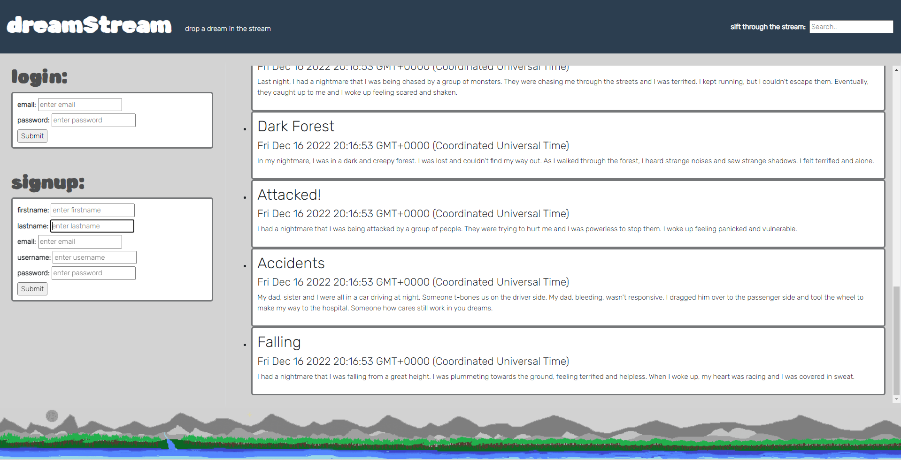

# Dream Journal

#### Table of Content:

#### [Description](#description)

#### [Criteria](#criteria)

#### [Usage](#usage)

#### [Contributing](#contributing)

#### [Screenshot](#screenshot)

#### [URL](#url)

## Description:

The purpose of this project was to create a website that will allow a user to sign in and create a post detailing a dream that they had. They will also be able to see the posts of other users as well as all of their own posts. This will allow them to track their own dreams over time as well as the dreams of their friends and others.

## Criteria:

GIVEN that I want to track my dreams.
WHEN I signup for an account.
THEN I can create a profile.
WHEN I have created a profile.
THEN I can login.
WHEN I have a dream that I want to remember.
THEN I can create a post detailing that dream.
WHEN I want to see the dreams of others.
THEN I can see all of the posts that have been made by other users.
WHEN I want to see the dreams that I have had.
THEN I can see all of the posts that I have made.
WHEN I want to see the details of a specific dream.
THEN I can click on the date of that dream to be directed to that post.

## Usage:

To use this application navigate to the home page and sign in if you have already created a profile. If you haven't then you can input your information into the signup fields and create a profile. Once you have signed in you will be able to see all of the recent posts from other users. Click on the button that says "drop a dream in the stream" in order to navigate to the post page. On the post page you will input the title of the dream, a description of that dream, and select whether it was a dream or a nightmare. Once all of this information has been added simply click submit to save the post. You will then be redirected to the home page where you will see your post as well as the posts of other users. You will also see all of the dates and titles of the posts that you have made in the "my posts" section on the left side of the page. Simply click the date of the post you want to see to be directed to that page. On the post page you will see the title, description, and whether it was a dream or a nightmare.

## Contributing:

Bryan Tempini: https://github.com/btempini

Marcelo Perez: https://github.com/mandresp

Omar Yassine: https://github.com/oyassine1999

Muhammet Toklu: https://github.com/mramazant

Maximilian Gibes: https://github.com/Slimshady079

## Screenshot:

## URL:

[Deployed Site](https://dream-stream270.herokuapp.com/)
